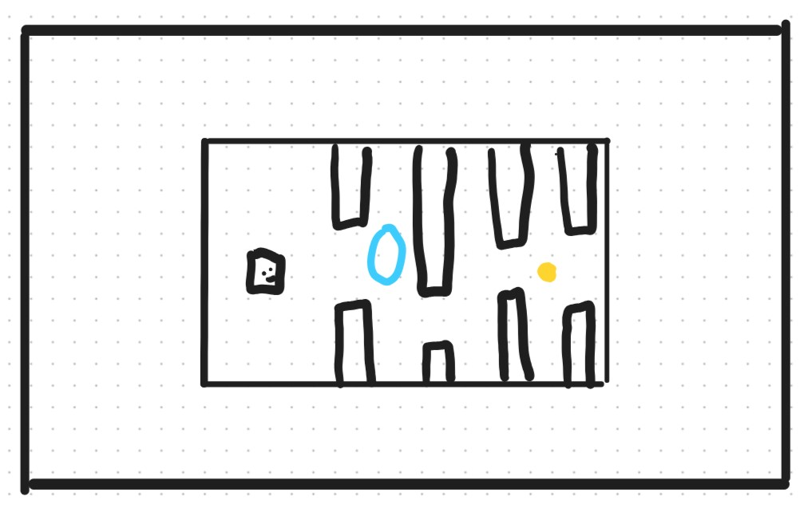

# Cappy bird
- Cappy bird is a game imitating the game flappy bird. It is played by pressing space, so that the bird jumps. When you play the game you have to press space often for gravity pulls the bird back down. Don't hit the pipes, you'll die. But you can start over by pressing space. The game tracks your points, you get 1 point for every pipe you get through and 1 point for every coin you hit.
- The game is made for a school project by jscode1003. The project consists of game.js, index.html and styles.css + bird.png and background.png. The game is coded in OOP with inheritance from GameObject to Bird, Pipe and Coin. The game is mainly made with JavaScript, but has html and css files to make the project clear and openable.

## Link to vercel
- Link to [Vercel version](https://cappy-bird.vercel.app/)
## Recipe to hack the game
- Open game by opening index.html in web, once loaded, the game runs purely client side or use the web vercel version 
- Press space to start the game
- Use space to make the bird jump.
- Learn how gravity on the bird works and get a feel for your tactics
- Don't hit the green pipes, you'll die!
- Try to hit coins, for 1 extra point.
- You get points for every pipe you get through
- Continue playing and compete with yourself or a friend to see who gets the highest highscore
- GOOD LUCK!

## Wireframe

## Bugs
- Coin can spawn on pipes, have tried to fix this but it doesn't work.
- Should have had a start button

## Credits
- background.png and bird.png taken from Google.
- Structure of code inspired by ManicMansion game code.
- Idea from the game Flappy Bird
- Google translate for translating this README

## License
- Use and change the game exactly as you want, but do not submit this as a school project and but that you made it and etc."# it2-avsluttende-oppgave" 
